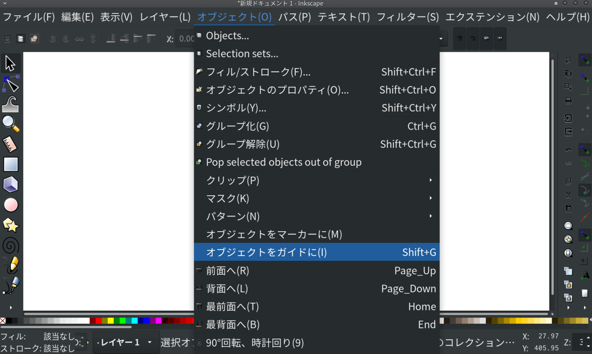

[Inkscape](https://inkscape.org) is a drawing software which is open source.

### how

Run Inkscape and create a new file

set file property
- vertical: width / height = 61 mm / 97 mm
- horizontal: width / height = 97 mm / 61 mm

* The below is a vertical case.

Create a Rectangle

Select it

Modify it: width / height = 55 mm / 91 mm
Set it: X / Y = 3.000 mm / 3.000 mm

Click Object menu "object to guide"

same procedure
Create a Rectangle
Modify it: width / height = 55 mm / 91 mm
set it: X / Y = 6.000 mm / 6.000 mm
Object menu: object to guide

same procedure
Create a Rectangle
Modify it: width / height = 30.5 mm / 48.5 mm
set it: X / Y = 0.000 mm / 0.000 mm
Object menu: object to guide

That's it.

