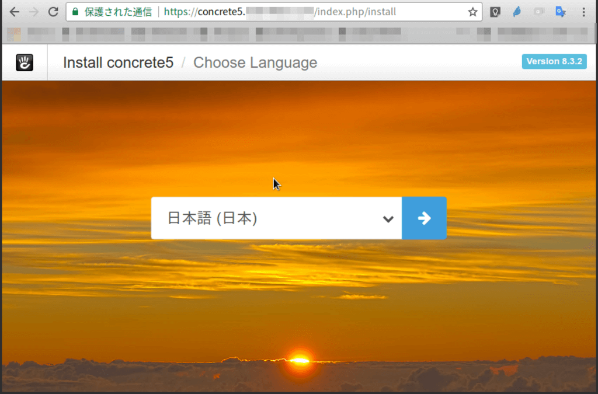
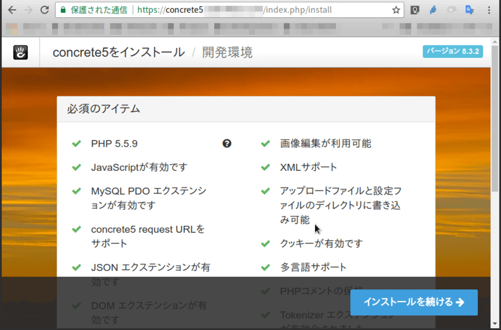
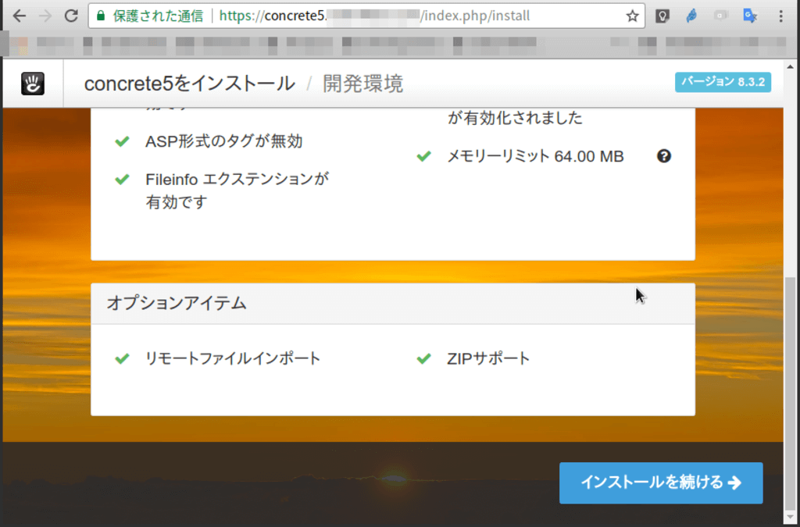
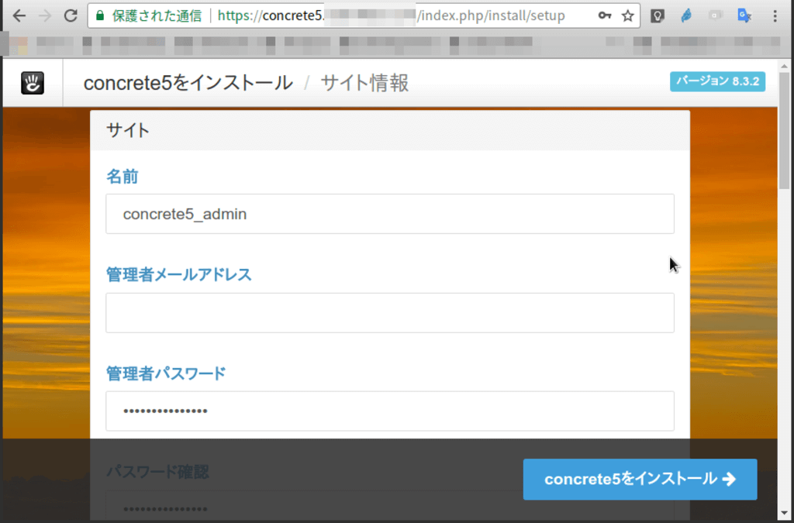
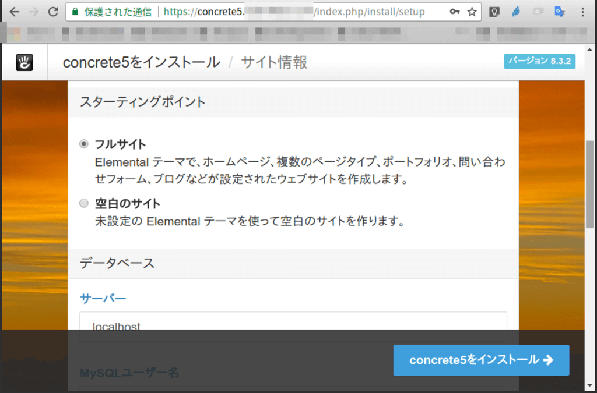
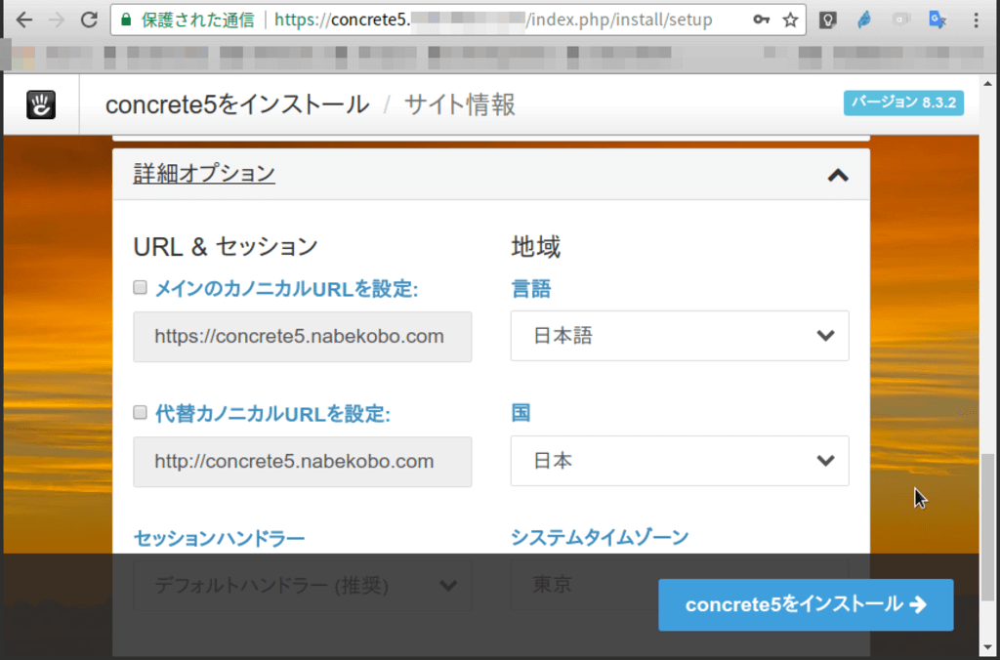
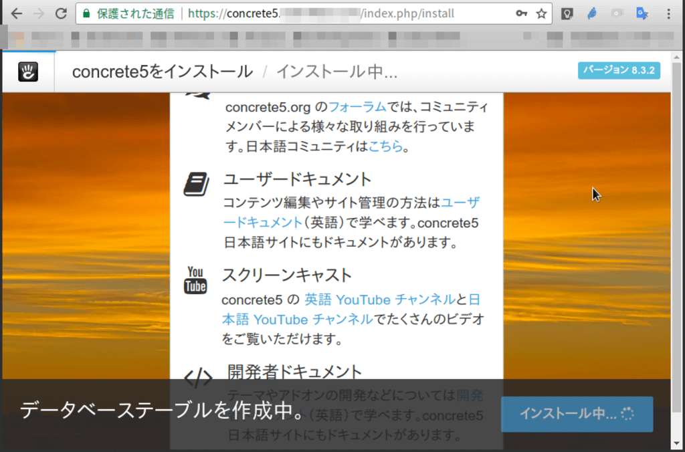
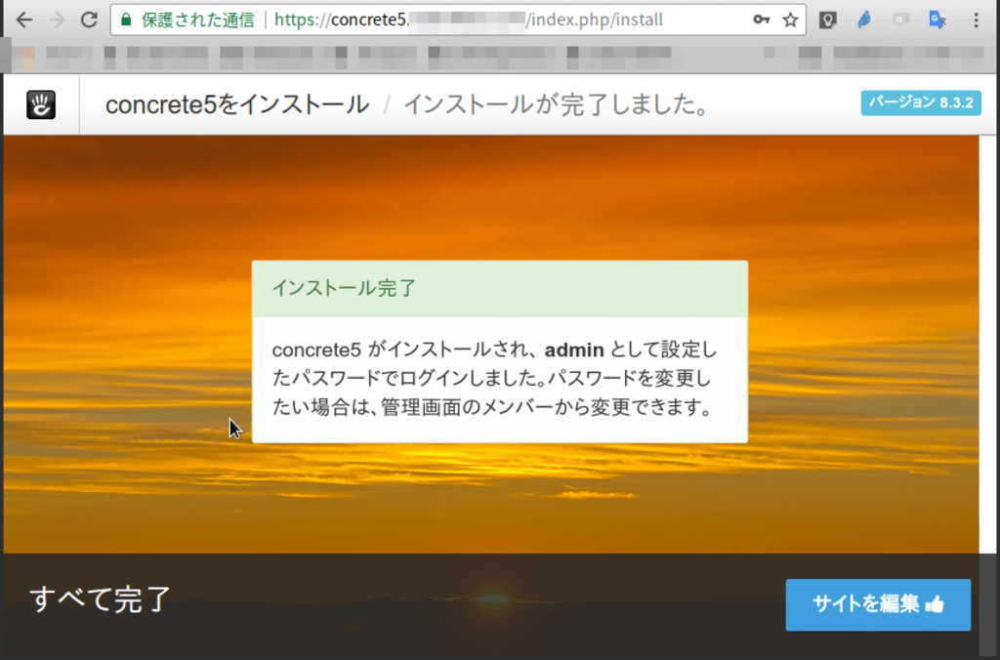
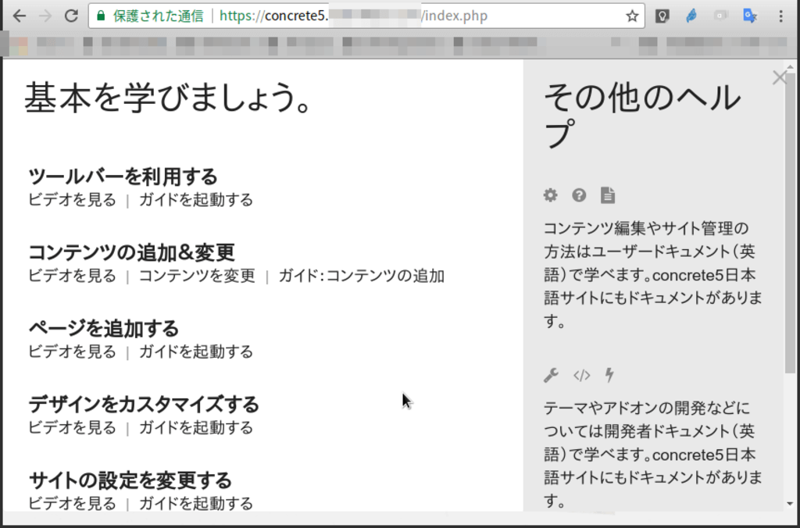

`https://documentation.concrete5.org/developers/installation/installation`

# Getting ready

- Check system requirement
    - `https://documentation.concrete5.org/developers/installation/system-requirements`
    - php7 is avairable

# Get app

`https://www.concrete5.org/download`

# Prepare dabatase

create mariadb database and a user

### Modify timezone

```
/usr/bin/mysql_tzinfo_to_sql /usr/share/zoneinfo > ~/timez
one.sql
mysql -u root -p -Dmysql < ~/timezone.sql
rm ~/timezone.sql
```

```
sudo nvim /etc/mysql/my.cnf
```

Edit: add a line in `[mysqld]` section

`default-time-zone = 'Asia/Tokyo'`

Restart maridb service

# Set up Nginx

# Set permission

```
sudo chown -R nginx:nginx concrete5

sudo chmod -R 755 concrete5/application/files
sudo chmod -R 755 concrete5/application/config
sudo chmod -R 755 concrete5/packages
sudo chmod -R 755 concrete5/updates
```

# Install via Web browser










